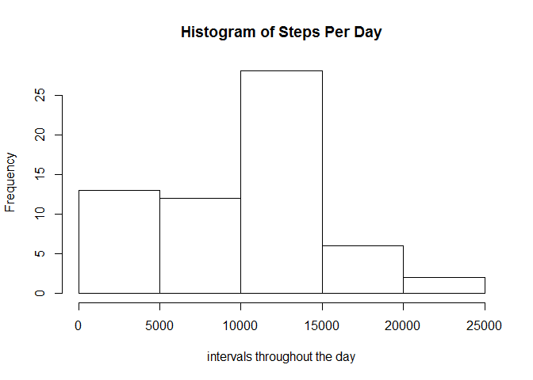
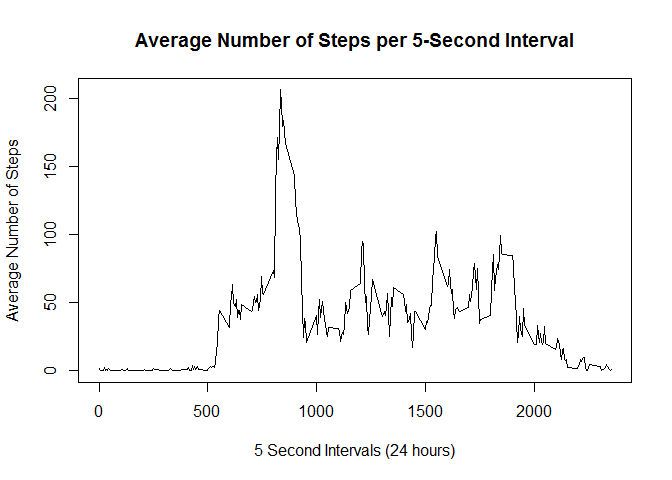
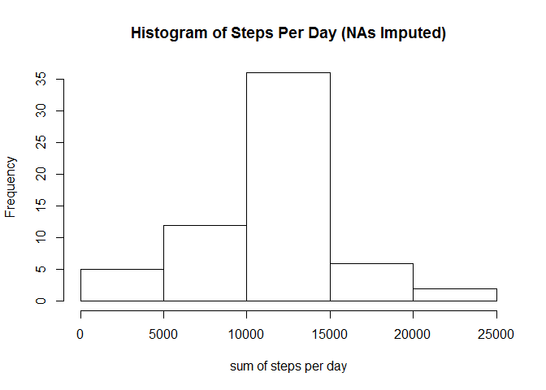
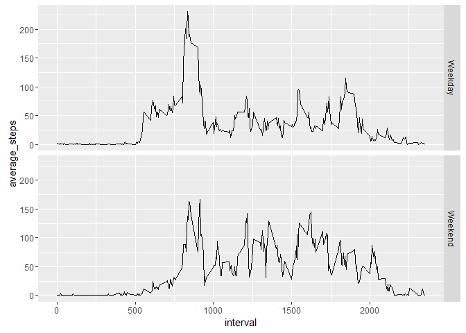

# Reproducible Research: Peer Assessment 1


## Loading and preprocessing the data
  
  
First, I will load the data and conduct some minor preprocessing:

```r
activity <- read.csv("data/activity.csv", stringsAsFactors=FALSE)
activity$dateFactor <- as.factor(activity$date)
act <- activity
head(act)
```

```
##   steps       date interval dateFactor
## 1    NA 2012-10-01        0 2012-10-01
## 2    NA 2012-10-01        5 2012-10-01
## 3    NA 2012-10-01       10 2012-10-01
## 4    NA 2012-10-01       15 2012-10-01
## 5    NA 2012-10-01       20 2012-10-01
## 6    NA 2012-10-01       25 2012-10-01
```

This 'act' copy will be the working copy of the dataframe I will use.

## What is mean total number of steps taken per day?  
  
  
To determine this, I will first need to bucket the steps together by day and find the total number of steps per day. In order to do this, I will use the group_by function from the dplyr package:

```r
suppressMessages(library(dplyr))
```

```
## Warning: package 'dplyr' was built under R version 3.2.3
```

```r
act.grouped <- group_by(act, dateFactor)
act.sum <- summarize(act.grouped, 'sum_steps'=sum(steps, na.rm = TRUE))  
act.sum
```

```
## Source: local data frame [61 x 2]
## 
##    dateFactor sum_steps
##        (fctr)     (int)
## 1  2012-10-01         0
## 2  2012-10-02       126
## 3  2012-10-03     11352
## 4  2012-10-04     12116
## 5  2012-10-05     13294
## 6  2012-10-06     15420
## 7  2012-10-07     11015
## 8  2012-10-08         0
## 9  2012-10-09     12811
## 10 2012-10-10      9900
## ..        ...       ...
```

```r
#histogram
hist(act.sum$sum_steps, main = "Histogram of Steps Per Day", xlab = "intervals throughout the day")
```

\
  
  
  
Once total per day is determined, I can find the average number of steps per day and the median number of steps per day:

```r
#average of steps per day
average.steps.per.day <- mean(act.sum$sum_steps, na.rm = TRUE)
average.steps.per.day
```

```
## [1] 9354.23
```

```r
#median of steps per day
median.steps.per.day <- median(na.omit(act.sum$sum_steps))
median.steps.per.day
```

```
## [1] 10395
```
  
  
  
## What is the average daily activity pattern?
Time series plot of the average number of steps taken:

```r
act.dailyacty <- group_by(act, interval)
act.dailyacty <- summarize(act.dailyacty, 'average_per_interval'=mean(steps, na.rm = TRUE))
head(act.dailyacty)
```

```
## Source: local data frame [6 x 2]
## 
##   interval average_per_interval
##      (int)                (dbl)
## 1        0            1.7169811
## 2        5            0.3396226
## 3       10            0.1320755
## 4       15            0.1509434
## 5       20            0.0754717
## 6       25            2.0943396
```

```r
#plot the results  
plot(act.dailyacty$interval, act.dailyacty$average_per_interval, type="l", xlab = "5 Second Intervals (24 hours)",
       ylab = "Average Number of Steps", main = "Average Number of Steps per 5-Second Interval")
```

\
  
  
  
The five minute interval that, on average, contains the maximum number of steps:

```r
max_steps_per_interval <- act.dailyacty[which(act.dailyacty$average_per_interval == max(act.dailyacty$average_per_interval)), ]
max_steps_per_interval
```

```
## Source: local data frame [1 x 2]
## 
##   interval average_per_interval
##      (int)                (dbl)
## 1      835             206.1698
```

## Imputing missing values

I chose to use interval means across all days to impute any values of steps that were missing from single-day intervals.  
This is how I imputed missing values:

```r
#first lets get a count of how many values we're dealing with that are missing!
  act.rmnas <- act
  sum(is.na(act.rmnas$steps))
```

```
## [1] 2304
```

```r
  #ok, going to use the means from act.dailyacty and map those to missing values in act.rmnas
  len1 <- nrow(act.rmnas)
  
  #use act.dailyacty as a lookup value for imputing NA values
  for(i in 1:len1) {
    if (is.na(act.rmnas[i, 1])) {
      
      #lookup in act.dailyacty
      tempLookup <- which(act.dailyacty$interval == act.rmnas[i, 3])
      act.rmnas[i, 1] = act.dailyacty[tempLookup, 2]
    }
  }
  
  #finally, lets recount how many NAs there are (should be zero)
  sum(is.na(act.rmnas$steps))
```

```
## [1] 0
```
  
  
  
This is the histogram and time series plot after imputing the missing values:

```r
#sum of steps per day
  act.rmnas.grouped <- group_by(act.rmnas, dateFactor)
  act.rmnas.sum <- summarize(act.rmnas.grouped, 'sum_steps'=sum(steps))
  
#histogram
  hist(act.rmnas.sum$sum_steps, main = "Histogram of Steps Per Day (NAs Imputed)", xlab = "sum of steps per day")
```

\
  
  
  
I also recalculated the mean and median values per day with the new data set with imputed values in place of NAs:

```r
#average of steps per day (imputed NAs)
  average.steps.per.day.rmnas <- mean(act.rmnas.sum$sum_steps)
  average.steps.per.day.rmnas
```

```
## [1] 10766.19
```

```r
#median of steps per day (imputed NAs)
  median.steps.per.day.rmnas <- median(act.rmnas.sum$sum_steps)
  median.steps.per.day.rmnas
```

```
## [1] 10766.19
```
These values happened to be the same.


## Are there differences in activity patterns between weekdays and weekends?

I stacked the weekend and weekday activity patterns on top of each other to inspect any potential differences:

```r
#lets use act.rmnas (imputed NAs dataset) as our fact table
  act.rmnas$date <- as.Date(act.rmnas$date)
  act.rmnas$day <- "WEEKDAY OR WEEKEND WILL GO HERE" #temporary string value
  
#determine if Weekend or Weekday record
  for(k in 1:nrow(act.rmnas)){ 
    if(weekdays(act.rmnas[k, 2]) == "Saturday" | weekdays(act.rmnas[k, 2]) == "Sunday") {
      act.rmnas[k, 5] <- "Weekend"
    } else {
      act.rmnas[k, 5] <- "Weekday"
    }
  }
  
#group by both interval and whether it is weekday or weekend
  act.rmnas.daygroups <- group_by(act.rmnas, interval, day)
  act.rmnas.daygroups <- summarize(act.rmnas.daygroups, 'average_steps'=mean(steps))
  
#plot
  suppressMessages(library(ggplot2))
```

```
## Warning: package 'ggplot2' was built under R version 3.2.3
```

```r
  myplot <- ggplot(act.rmnas.daygroups, aes(x=interval, y=average_steps)) + geom_line()
  myplot + facet_grid(day ~ .)
```

\

See my entire R script located in this repository!
